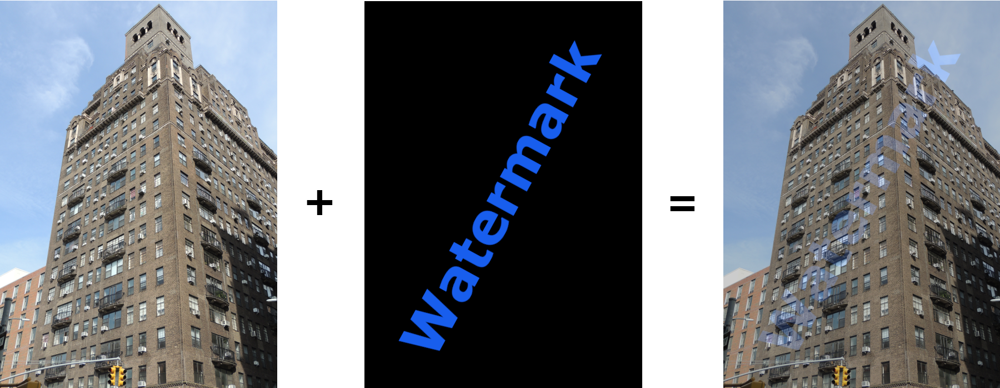
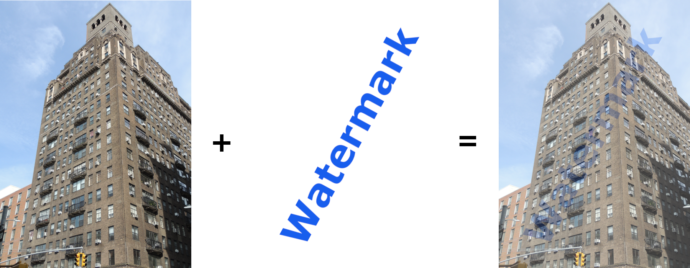

# Stage 2/5: Blending images
## Description
In this stage, we will start blending images. To keep things simple, we will be dealing with transparency in this stage. Two images should have the same dimensions. Also, all images in this project must be either 24-bit or 32-bit.

Generally, the procedure of blending two identically sized images is very straightforward. Each pixel in an output image has a value that is a linear combination of the pixel color values in input images. Pixel color values of input images are weighted as per users' wishes.

The procedure is as follows:
- Get the <b>watermark weight percentage</b> `weight` from users. Here, we will use only integer operations, so we require this percentage to be an integer number between `0` to `100`.
- For each pixel position `(x, y)` in the input images, read the `Color` from the watermarked image and the `Color` from the watermark image. For example:

```
val i = Color(image.getRGB(x, y))
val w = Color(watermark.getRGB(x, y))
```

where `image` and `watermark` are `BufferedImage` instances for the two input images.

- Calculate the `Color` <b>for the corresponding pixel</b> of the output image:

```
val color = Color(
                (weight * w.red + (100 - weight) * i.red) / 100,
                (weight * w.green + (100 - weight) * i.green) / 100,
                (weight * w.blue + (100 - weight) * i.blue) / 100
            )
```

- Set it at the output `BufferedImage` instance at position `(x, y)` as `output.setRGB(x, y, color.rgb)`, where `output` is a `BufferedImage` instance.

Since we don't use transparency in this stage, the result images aren't truly watermarked. They are nothing but two blended images.


Images blended with 20% watermark transparency percentage


Images blended with 20% watermark transparency percentage

As you can see, the resulting image is affected by the watermark logo background. However, we will work on it in the next stages by introducing transparency in two different ways to achieve true watermarking.

In this project, it's a good idea to use the `exitProcess()` function to exit our program at any time. Refer to the <a href="https://kotlinlang.org/api/latest/jvm/stdlib/kotlin.system/exit-process.html">Kotlin documentation</a> for more details.

## Objectives
Ask for an image filename with the following message: `Input the image filename:`. Users should input a filename:

- If the file doesn't exist, print `The file [filename] doesn't exist.` and terminate the program (Example 2);
- If the image doesn't have 3 color components, print `The number of image color components isn't 3.` and terminate the program (Example 3);
- If the image isn't 24 or 32-bit, then print `The image isn't 24 or 32-bit.` and terminate the program (Example 4).

Ask for a watermark image filename with the message `Input the watermark image filename:`. Users are expected to input the watermark filename:

- If the watermark file doesn't exist, print `The file [watermark filename] doesn't exist.` and terminate the program (Example 5);
- If the watermark image doesn't have 3 color components, print `The number of watermark color components isn't 3.` and terminate the program (Example 6);
- If the watermark image doesn't use a 24-bit or a 32-bit color scheme, then print `The watermark isn't 24 or 32-bit.` and terminate the program (Example 7);
- Compare the dimensions of two images; if they are different, print `The image and watermark dimensions are different.` and terminate the program (Example 8).

Ask for the watermark color weight percentage with the message `Input the watermark transparency percentage (Integer 0-100):`

- If the input isn't an integer number, print `The transparency percentage isn't an integer number.` and terminate the program (Example 9);
- If the input is an integer number but outside the 0-100 range, print `The transparency percentage is out of range.` and terminate the program (Example 10).

Ask for the output image filename with the message `Input the output image filename (jpg or png extension):`

- If a provided filename doesn't have `.jpg` or `.png` extension, print `The output file extension isn't "jpg" or "png".` and terminate the program (Example 11).

Create the output image by blending the image and the watermark, save it as the provided output image filename, and then print `The watermarked image [output filename] has been created.` (Example 1). The blending should be done as described in the Description section. Output images must be saved as `BufferedImage.TYPE_INT_RGB` — the 24-bit color scheme without the alpha channel.

If you need some image files to experiment with your code for stage 2, then you can <a href="https://stepik.org/media/attachments/lesson/623865/stage2.zip">download this zip file</a>.

## Examples
The greater-than symbol followed by a space (`> `) represents the user input. Note that it's not part of the input.

<b>Example 1:</b> <i>normal execution</i>
```
Input the image filename:
> myimage.jpg
Input the watermark image filename:
> logo.jpg
Input the watermark transparency percentage (Integer 0-100):
> 20
Input the output image filename (jpg or png extension):
> out.png
The watermarked image out.png has been created.
```

<b>Example 2:</b> <i>the image doesn't exist</i>
```
Input the image filename:
> winter.jpg
The file winter.jpg doesn't exist.
```

<b>Example 3:</b> <i>the image color components aren't 3</i>
```
Input the image filename:
> greyscale_image.jpg
The number of image color components isn't 3.
```

<b>Example 4:</b> <i>the image isn't 24-bit or 32-bit</i>
```
Input the image filename:
> 256_colors_image.png
The image isn't 24 or 32 bit.
```

<b>Example 5:</b> <i>the watermark image doesn't exist</i>
```
Input the image filename:
> myimage.jpg
Input the watermark image filename:
> nologo.jpg
The file nologo.jpg doesn't exist.
```

<b>Example 6:</b> <i>the watermark image color components aren't 3</i>
```
Input the image filename:
> myimage.jpg
Input the watermark image filename:
> greyscale_logo.jpg
The number of watermark color components isn't 3.
```

<b>Example 7:</b> <i>The watermark image doesn't use a 24-bit or 32-bit color scheme</i>
```
Input the image filename:
> myimage.jpg
Input the watermark image filename:
> 256_colors_logo.png
The watermark isn't 24 or 32-bit.
```

<b>Example 8:</b> <i>different dimensions</i>
```
Input the image filename:
> myimage.jpg
Input the watermark image filename:
> some_logo.png
The image and watermark dimensions are different.
```

<b>Example 9:</b> <i>the transparency percentage isn't an integer number</i>
```
Input the image filename:
> myimage.jpg
Input the watermark image filename:
> logo.jpg
Input the watermark transparency percentage (Integer 0-100):
> ten
The transparency percentage isn't an integer number.
```

<b>Example 10:</b> <i>the transparency percentage is out of range</i>
```
Input the image filename:
> myimage.jpg
Input the watermark image filename:
> logo.jpg
Input the watermark transparency percentage (Integer 0-100):
> 101
The transparency percentage is out of range.
```

<b>Example 11:</b> <i>wrong output image file extension</i>
```
Input the image filename:
> myimage.jpg
Input the watermark image filename:
> logo.jpg
Input the watermark transparency percentage (Integer 0-100):
> 20
Input the output image filename (jpg or png extension):
> out.gif
The output file extension isn't "jpg" or "png".
```
