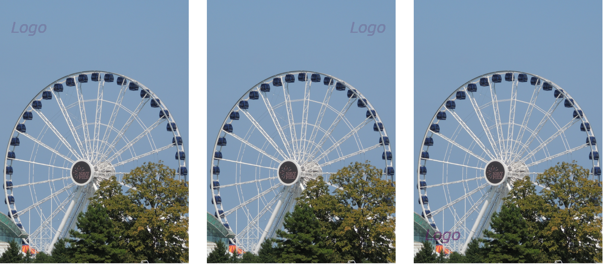
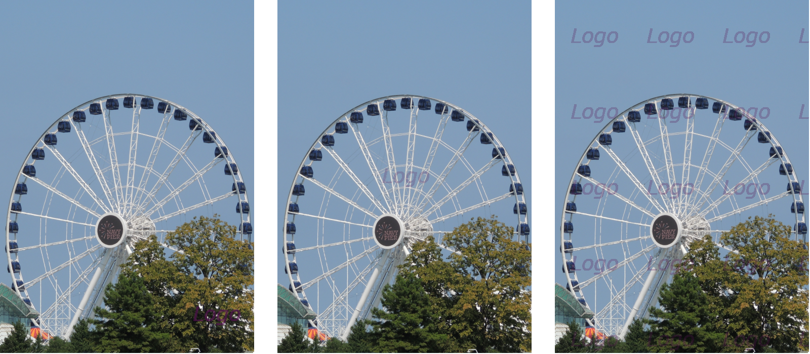
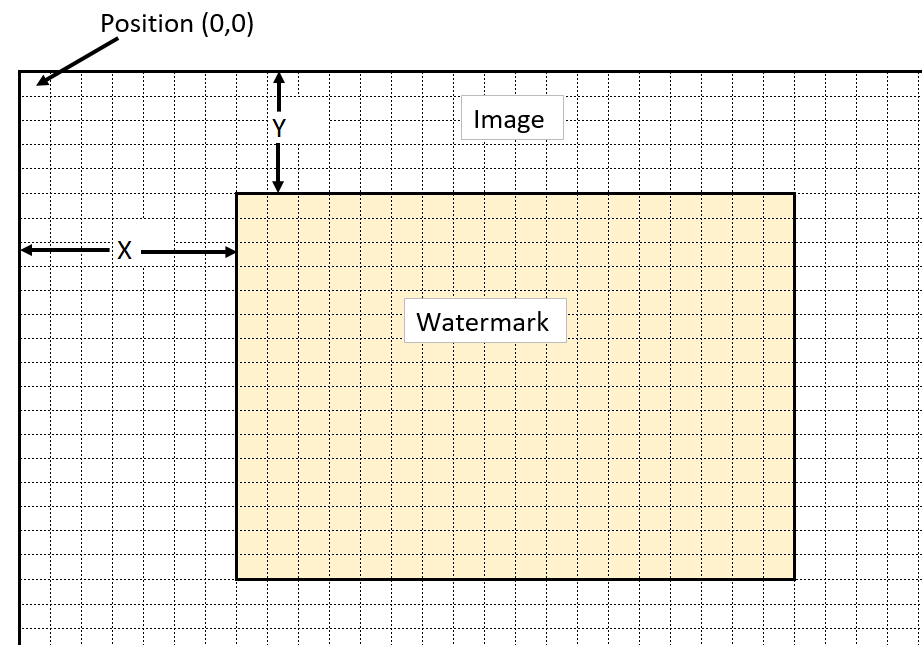

# Stage 5/5: No more restrictions
## Description
In the final stage, we will lift the image requirements of sharing the dimensions! But for simplicity, limit the watermark image — it must be smaller or equal to the original image. The error message for different dimensions of two images isn't valid anymore, so a new one will be used, in case a dimension of the watermark image is larger than the original image dimension.

In this stage, we will put a <b>single</b> watermark logo or several as a <b>grid</b>. Take a look at some examples:


<div style="text-align: center;">Top-left, Top-right and bottom-left</div>


<div style="text-align: center;">Bottom-right, in the middle and grid</div>

If users want to place a single watermark, ask for its position. The position is denoted by two integer numbers (`X` for horizontal and `Y` for vertical) that are the number of pixels from the top-left corner. `(0,0)` is the initial position (see the Figure below). `X` is a value from `0` to `<Image width - Watermark width>`, and `Y` is a value from `0 to <Image height - Watermark height>`:



The watermark pixels should be blended with the image pixels as in the previous stage. All other image pixels remain the same.

You may want to position the watermark as a grid. In this case, the watermark should be initially set at the top-left corner. Then repeat the watermark towards the right corner and the bottom until all space is covered.

## Objectives
- Compare the dimensions of the two images. If the watermark image has at least one dimension larger than the dimension of the original image, print `The watermark's dimensions are larger.` and terminate the program (Example 8);
- Before asking users for the output image filename, ask for the position method with `Choose the position method (single, grid):`, and read the user input. If this input isn't `single` or `grid`, print `The position method input is invalid.` and terminate the program (Example 5);
- If the user input is `single`, then print `Input the watermark position ([x 0-DiffX] [y 0-DiffY]):`, where `DiffX` is an integer equal to the subtraction `<Image width - Watermark width>`, and `DiffY` is an integer equal to the subtraction `<Image height - Watermark height>` (Examples 1 and 2). The position is two integers in the given range, separated by one space;
- If the position input is correct, create the output image as described in the Description section (Examples 1 and 2);
- If the position input isn't valid, print `The position input is invalid.` and terminate the program (Example 6);
- If the input integers are out of range, print `The position input is out of range.` and terminate the program (Example 7);
- If the user input is `grid`, create the output image as described in the Description section (Examples 3 and 4).

If you need some image files to experiment with your code for stage 5, then you can <a href="https://stepik.org/media/attachments/lesson/623865/stage5.zip">download this zip file</a>.

## Examples
The greater-than symbol followed by a space (`> `) represents the user input. Note that it's not part of the input.

<b>Example 1:</b> <i>a single watermark (image 500x700, watermark 150x150)</i>
```
Input the image filename:
> image.jpg
Input the watermark image filename:
> watermark.jpg
Do you want to set a transparency color?
> yes
Input a transparency color ([Red] [Green] [Blue]):
> 255 255 255
Input the watermark transparency percentage (Integer 0-100):
> 20
Choose the position method (single, grid):
> single
Input the watermark position ([x 0-350] [y 0-550]):
> 100 100
Input the output image filename (jpg or png extension):
> out.jpg
The watermarked image out.jpg has been created.
```

<b>Example 2:</b> <i>a single watermark with the alpha channel (image 500x700, watermark 150x150)</i>
```
Input the image filename:
> image.jpg
Input the watermark image filename:
> watermark.jpg
Do you want to use the watermark's Alpha channel?
> yes
Input the watermark transparency percentage (Integer 0-100):
> 20
Choose the position method (single, grid):
> single
Input the watermark position ([x 0-350] [y 0-550]):
> 100 100
Input the output image filename (jpg or png extension):
> out.jpg
The watermarked image out.jpg has been created.
```

<b>Example 3:</b> <i>grid watermarks</i>
```
Input the image filename:
> image.jpg
Input the watermark image filename:
> watermark.jpg
Do you want to set a transparency color?
> yes
Input a transparency color ([Red] [Green] [Blue]):
> 255 255 255
Input the watermark transparency percentage (Integer 0-100):
> 20
Choose the position method (single, grid):
> grid
Input the output image filename (jpg or png extension):
> out.png
The watermarked image out.png has been created.
```

<b>Example 4:</b> <i>grid watermarks with the alpha channel</i>
```
Input the image filename:
> image.jpg
Input the watermark image filename:
> watermark.jpg
Do you want to use the watermark's Alpha channel?
> yes
Input the watermark transparency percentage (Integer 0-100):
> 20
Choose the position method (single, grid):
> grid
Input the output image filename (jpg or png extension):
> out.png
The watermarked image out.png has been created.
```

<b>Example 5:</b> <i>invalid position method</i>
```
Input the image filename:
> image.jpg
Input the watermark image filename:
> watermark.jpg
Do you want to set a transparency color?
> yes
Input a transparency color ([Red] [Green] [Blue]):
> 255 255 255
Input the watermark transparency percentage (Integer 0-100):
> 20
Choose the position method (single, grid):
> pos
The position method input is invalid.
```

<b>Example 6:</b> <i>invalid position input (image 500x700, watermark 150x150)</i>
```
Input the image filename:
> image.jpg
Input the watermark image filename:
> watermark.jpg
Do you want to set a transparency color?
> yes
Input a transparency color ([Red] [Green] [Blue]):
> 255 255 255
Input the watermark transparency percentage (Integer 0-100):
> 20
Choose the position method (single, grid):
> single
Input the watermark position ([x 0-350] [y 0-550]):
> top right
The position input is invalid.
```

<b>Example 7:</b> <i>position is out of range (image 500x700, watermark 150x150)</i>
```
Input the image filename:
> image.jpg
Input the watermark image filename:
> watermark.jpg
Do you want to set a transparency color?
> yes
Input a transparency color ([Red] [Green] [Blue]):
> 255 255 255
Input the watermark transparency percentage (Integer 0-100):
> 20
Choose the position method (single, grid):
> single
Input the watermark position ([x 0-350] [y 0-550]):
> 500 0
The position input is out of range.
```

<b>Example 8:</b> <i>dimensions are larger</i>
```
Input the image filename:
> image.jpg
Input the watermark image filename:
> watermark.jpg
The watermark's dimensions are larger.
```
