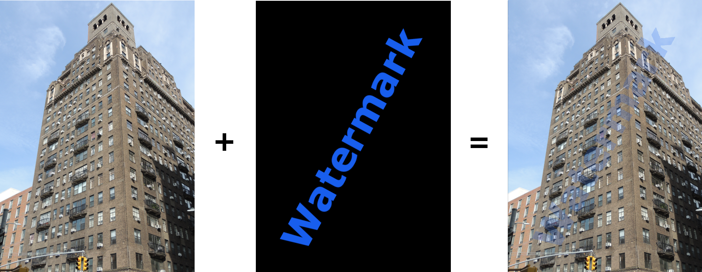

# Stage 3/5: Alpha channel transparency
## Description
In the previous stage, we've learned how to blend two images. Technically speaking, it is not true watermarking, as, in genuine watermarking, only a part of a watermark image (a logo or text) is blended with the original image. In this stage, we will use the alpha channel to achieve this.

If an image uses the alpha channel, then its `transparency` property is set to `TRANSLUCENT`. An alpha channel can take 256 different transparency values for every pixel, but in most cases, it is used with only two values — `0` and `255`. This happens because we are interested in only two states — <b>opaque</b> or <b>total transparent</b> (`255` and `0`, respectively).

If an image is using the alpha channel, then the `Color` for each pixel should be read as:
```
val w = Color(watermark.getRGB(x, y), true)
```

Otherwise, all pixels are set as opaque.

We will use the alpha channel in the following manner. If a watermark pixel has an alpha channel value equal to `0`, the corresponding output pixel should be the same as the original image pixel. If it has an alpha channel value equal to `255`, then the output pixel is the linear combination of the original image and the watermark pixels, <b>exactly as in the previous stage</b> by using the watermark transparency percentage. By doing this, we can divide our pixels into two categories based on the value of the watermark alpha channel for each pixel.

In the following example, the watermark image has the alpha channel that is used during the blending. The resulting image is the same as the original, with the exception where it is blended with the logo.


Images blended with 20% watermark transparency percentage

## Objectives
- <b>Start exactly as in the previous stage</b> by reading the image and watermark filenames. Print an error message, if any error occurs and end the program (as in stage 2). Eg. if the images dimensions are different, print `The image and watermark dimensions are different.` and exit.

- After reading the watermark image filename, check the watermark image `transparency` property;

- If it is `TRANSLUCENT`, ask users whether they want to use the alpha channel with the message `Do you want to use the watermark's Alpha channel?`;

- If the input is `yes` (case insensitive), use the alpha channel to produce the output image (Example 1), as described above. If users input anything else, continue as in the previous stage (Example 2) without the alpha channel;

- If the image `transparency` property isn't `TRANSLUCENT`, continue as in the previous stage (Example 3).

If you need some image files to experiment with your code for stage 3, then you can <a href="https://stepik.org/media/attachments/lesson/623865/stage3.zip">download this zip file</a>.

## Examples
The greater-than symbol followed by a space (`> `) represents the user input. Note that it's not part of the input.

<b>Example 1:</b> <i>the watermark image employs the alpha channel</i>
```
Input the image filename:
> image.jpg
Input the watermark image filename:
> watermark.png
Do you want to use the watermark's Alpha channel?
> yes
Input the watermark transparency percentage (Integer 0-100):
> 20
Input the output image filename (jpg or png extension):
> watermarked.png
The watermarked image watermarked.png has been created.
```

<b>Example 2:</b> <i>the image has the alpha channel present, but the user doesn't want to employ it</i>
```
Input the image filename:
> image.jpg
Input the watermark image filename:
> watermark.png
Do you want to use the watermark's Alpha channel?
> no
Input the watermark transparency percentage (Integer 0-100):
> 20
Input the output image filename (jpg or png extension):
> watermarked.png
The watermarked image watermarked.png has been created.
```

<b>Example 3:</b> <i>the watermark image doesn't have the alpha channel</i>
```
Input the image filename:
> image.jpg
Input the watermark image filename:
> logo_no_alpha.jpg
Input the watermark transparency percentage (Integer 0-100):
> 20
Input the output image filename (jpg or png extension):
> output.png
The watermarked image output.png has been created.
```
